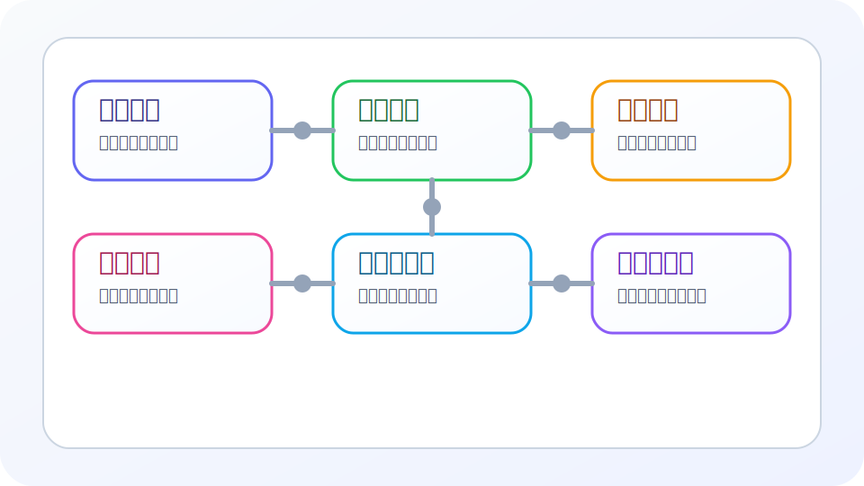

这是一篇专门为当前博客准备的“富内容笔记示例”。

它的目的不是讲某一个具体学科，而是示范：**如果你以后要写一篇可长期积累、可同步公众号、也适合自己回查的研究型笔记，结构可以怎么组织。**

## 1. 研究问题

假设我们现在要做一件事情：

> 为“长期写作系统”设计一套统一的笔记结构，让一篇笔记既能在网站中良好展示，也能顺畅同步到微信公众号。

这类问题通常需要回答四件事：

1. 我到底要解决什么问题？
2. 我判断有效的标准是什么？
3. 我需要记录哪些中间过程？
4. 最后怎样把内容转化成可执行的下一步？

## 2. 笔记结构图



上图可以理解为一篇研究笔记的六个核心区块：

- 问题定义
- 资料整理
- 实验设计
- 结果记录
- 分析与公式
- 结论与行动

如果你以后每篇笔记都大致沿着这个结构写，长期回看时会非常舒服。

## 3. 一个可操作的记录框架

下面这张表可以作为你每篇笔记的最小骨架：

| 模块 | 建议记录内容 | 为什么重要 |
| --- | --- | --- |
| 问题定义 | 目标、约束、假设 | 防止写着写着偏题 |
| 背景资料 | 参考文献、数据来源、前置结论 | 便于后续追溯 |
| 实验设计 | 变量、步骤、评价指标 | 保证过程可复现 |
| 结果记录 | 表格、现象、截图、异常 | 防止只记结论不记过程 |
| 分析推导 | 公式、模型、误差分析 | 把“感觉”变成“证据” |
| 行动项 | 结论、问题、下一步 | 让笔记真正推动行动 |

## 4. 一个简单的评分模型

如果我们要衡量一篇笔记的“完成度”，可以定义一个非常简单的综合评分：

行内公式示例：笔记分数记为 $S$。

$$
S = \alpha C + \beta E + \gamma R + \delta A
$$

其中：

- $C$ 表示内容完整性
- $E$ 表示证据充分性
- $R$ 表示可复现程度
- $A$ 表示行动可执行性

并且可以约束：

$$
\alpha + \beta + \gamma + \delta = 1,\quad \alpha,\beta,\gamma,\delta \ge 0
$$

如果你更偏向“研究记录”，通常会把 $\beta$ 和 $\gamma$ 设得更高；  
如果你更偏向“行动复盘”，通常会把 $\delta$ 设得更高。

## 5. 一个实验记录表

假设我们尝试了三种不同的笔记结构，记录结果如下：

| 方案 | 完整性 C | 可复现 R | 同步公众号难度 | 总体评价 |
| --- | ---: | ---: | ---: | --- |
| 纯 Markdown 结构化笔记 | 8.5 | 9.0 | 低 | 最推荐 |
| MDX + 多组件增强 | 9.5 | 7.0 | 高 | 适合网站专用 |
| 只写零散段落 | 4.0 | 3.5 | 中 | 不适合长期积累 |

从这个表可以得到一个很朴素但很有用的结论：

> **如果你追求长期写作与多端同步的平衡，结构化的纯 Markdown 往往是最优解。**

## 6. 结果分析

为了更明确地说明“为什么纯 Markdown 更合适”，我们可以把它拆成三个层面：

### 6.1 写作成本

- 工具门槛低
- 文件可移植性强
- 不依赖特定平台后台

### 6.2 管理成本

- 能放进 Git
- 能做全文检索
- 能长期归档

### 6.3 分发成本

- 网站直接渲染
- 微信公众号可导出后再排版
- 后续迁移到别的平台也比较容易

## 7. 一个更接近实验推导的公式例子

如果我们把“笔记价值”理解为随时间累积的函数，可以写成：

$$
V(t) = V_0 + \int_0^t \left( k_1 \cdot W(\tau) + k_2 \cdot R(\tau) \right) d\tau
$$

其中：

- $W(\tau)$ 表示在时间 $\tau$ 时刻写下的新内容量
- $R(\tau)$ 表示在时间 $\tau$ 时刻被再次检索和复用的频率

这个模型的直觉非常重要：

> 一篇笔记的价值，不只来自“第一次写下来”，还来自“以后反复被用到”。

所以好的笔记不是一次性表达，而是为了未来的自己进行设计。

## 8. 一段示例代码

如果你想给自己的笔记做一个最简单的“完成度估计器”，甚至可以写成这样：

```python
def note_score(completeness, evidence, reproducibility, actionability):
    alpha = 0.30
    beta = 0.25
    gamma = 0.25
    delta = 0.20
    return (
        alpha * completeness
        + beta * evidence
        + gamma * reproducibility
        + delta * actionability
    )
```

这段代码本身不复杂，但它起到了一个很好的作用：

- 把模糊印象变成了显式结构
- 帮助你反思一篇笔记为什么“看起来完整”或“看起来空”

## 9. 检查清单

写完一篇研究型笔记后，可以用这个 checklist 快速自查：

- [x] 问题是否定义清楚
- [x] 是否交代了背景与假设
- [x] 是否有公式或模型支撑分析
- [x] 是否有表格或结果记录
- [x] 是否有图片或结构图帮助理解
- [x] 是否有清晰结论
- [x] 是否写出了下一步行动

## 10. 常见问题

### 10.1 为什么一篇笔记里要同时放图片、表格和公式？

因为它们解决的是不同层面的表达问题：

- 图片更适合表达结构和流程
- 表格更适合横向比较
- 公式更适合精确定义关系

### 10.2 会不会太复杂？

不会。

关键不是每篇都必须写满，而是你要知道：

- 当需要结构图时放图片
- 当需要比较时放表格
- 当需要严谨定义时放公式

## 11. 一段更像“给未来自己看的总结”

如果以后你只允许自己记住这篇笔记的一句话，那应该是：

> **一篇真正有长期价值的笔记，不只是记录结论，而是记录“问题—过程—证据—结论—行动”这一整条链路。**

## 12. 下一步行动

你可以把这篇示例直接当成模板来模仿：

1. 换掉标题和摘要
2. 把“研究问题”替换成你当前真正关心的问题
3. 把表格换成你自己的数据
4. 把公式换成你自己的模型
5. 把“下一步行动”改成可执行任务

如果一篇笔记能做到这一点，那么它就不仅是“写过一篇文章”，而是“沉淀了一次可复用的思考过程”。

这是一篇专门为当前博客准备的“富内容笔记示例”。

它的目的不是讲某一个具体学科，而是示范：**如果你以后要写一篇可长期积累、可同步公众号、也适合自己回查的研究型笔记，结构可以怎么组织。**

## 1. 研究问题

假设我们现在要做一件事情：

> 为“长期写作系统”设计一套统一的笔记结构，让一篇笔记既能在网站中良好展示，也能顺畅同步到微信公众号。

这类问题通常需要回答四件事：

1. 我到底要解决什么问题？
2. 我判断有效的标准是什么？
3. 我需要记录哪些中间过程？
4. 最后怎样把内容转化成可执行的下一步？

## 2. 笔记结构图


上图可以理解为一篇研究笔记的六个核心区块：

- 问题定义
- 资料整理
- 实验设计
- 结果记录
- 分析与公式
- 结论与行动

如果你以后每篇笔记都大致沿着这个结构写，长期回看时会非常舒服。

## 3. 一个可操作的记录框架

下面这张表可以作为你每篇笔记的最小骨架：

| 模块 | 建议记录内容 | 为什么重要 |
| --- | --- | --- |
| 问题定义 | 目标、约束、假设 | 防止写着写着偏题 |
| 背景资料 | 参考文献、数据来源、前置结论 | 便于后续追溯 |
| 实验设计 | 变量、步骤、评价指标 | 保证过程可复现 |
| 结果记录 | 表格、现象、截图、异常 | 防止只记结论不记过程 |
| 分析推导 | 公式、模型、误差分析 | 把“感觉”变成“证据” |
| 行动项 | 结论、问题、下一步 | 让笔记真正推动行动 |

## 4. 一个简单的评分模型

如果我们要衡量一篇笔记的“完成度”，可以定义一个非常简单的综合评分：

行内公式示例：笔记分数记为 $S$。

$$
S = \alpha C + \beta E + \gamma R + \delta A
$$

其中：

- $C$ 表示内容完整性
- $E$ 表示证据充分性
- $R$ 表示可复现程度
- $A$ 表示行动可执行性

并且可以约束：

$$
\alpha + \beta + \gamma + \delta = 1,\quad \alpha,\beta,\gamma,\delta \ge 0
$$

如果你更偏向“研究记录”，通常会把 $\beta$ 和 $\gamma$ 设得更高；  
如果你更偏向“行动复盘”，通常会把 $\delta$ 设得更高。

## 5. 一个实验记录表

假设我们尝试了三种不同的笔记结构，记录结果如下：

| 方案 | 完整性 C | 可复现 R | 同步公众号难度 | 总体评价 |
| --- | ---: | ---: | ---: | --- |
| 纯 Markdown 结构化笔记 | 8.5 | 9.0 | 低 | 最推荐 |
| MDX + 多组件增强 | 9.5 | 7.0 | 高 | 适合网站专用 |
| 只写零散段落 | 4.0 | 3.5 | 中 | 不适合长期积累 |

从这个表可以得到一个很朴素但很有用的结论：

> **如果你追求长期写作与多端同步的平衡，结构化的纯 Markdown 往往是最优解。**

## 6. 结果分析

为了更明确地说明“为什么纯 Markdown 更合适”，我们可以把它拆成三个层面：

### 6.1 写作成本

- 工具门槛低
- 文件可移植性强
- 不依赖特定平台后台

### 6.2 管理成本

- 能放进 Git
- 能做全文检索
- 能长期归档

### 6.3 分发成本

- 网站直接渲染
- 微信公众号可导出后再排版
- 后续迁移到别的平台也比较容易

## 7. 一个更接近实验推导的公式例子

如果我们把“笔记价值”理解为随时间累积的函数，可以写成：

$$
V(t) = V_0 + \int_0^t \left( k_1 \cdot W(\tau) + k_2 \cdot R(\tau) \right) d\tau
$$

其中：

- $W(\tau)$ 表示在时间 $\tau$ 时刻写下的新内容量
- $R(\tau)$ 表示在时间 $\tau$ 时刻被再次检索和复用的频率

这个模型的直觉非常重要：

> 一篇笔记的价值，不只来自“第一次写下来”，还来自“以后反复被用到”。

所以好的笔记不是一次性表达，而是为了未来的自己进行设计。

## 8. 一段示例代码

如果你想给自己的笔记做一个最简单的“完成度估计器”，甚至可以写成这样：

```python
def note_score(completeness, evidence, reproducibility, actionability):
    alpha = 0.30
    beta = 0.25
    gamma = 0.25
    delta = 0.20
    return (
        alpha * completeness
        + beta * evidence
        + gamma * reproducibility
        + delta * actionability
    )
```

这段代码本身不复杂，但它起到了一个很好的作用：

- 把模糊印象变成了显式结构
- 帮助你反思一篇笔记为什么“看起来完整”或“看起来空”

## 9. 检查清单

写完一篇研究型笔记后，可以用这个 checklist 快速自查：

- [x] 问题是否定义清楚
- [x] 是否交代了背景与假设
- [x] 是否有公式或模型支撑分析
- [x] 是否有表格或结果记录
- [x] 是否有图片或结构图帮助理解
- [x] 是否有清晰结论
- [x] 是否写出了下一步行动

## 10. 常见问题

### 10.1 为什么一篇笔记里要同时放图片、表格和公式？

因为它们解决的是不同层面的表达问题：

- 图片更适合表达结构和流程
- 表格更适合横向比较
- 公式更适合精确定义关系

### 10.2 会不会太复杂？

不会。

关键不是每篇都必须写满，而是你要知道：

- 当需要结构图时放图片
- 当需要比较时放表格
- 当需要严谨定义时放公式

## 11. 一段更像“给未来自己看的总结”

如果以后你只允许自己记住这篇笔记的一句话，那应该是：

> **一篇真正有长期价值的笔记，不只是记录结论，而是记录“问题—过程—证据—结论—行动”这一整条链路。**

## 12. 下一步行动

你可以把这篇示例直接当成模板来模仿：

1. 换掉标题和摘要
2. 把“研究问题”替换成你当前真正关心的问题
3. 把表格换成你自己的数据
4. 把公式换成你自己的模型
5. 把“下一步行动”改成可执行任务

如果一篇笔记能做到这一点，那么它就不仅是“写过一篇文章”，而是“沉淀了一次可复用的思考过程”。

这是一篇专门为当前博客准备的“富内容笔记示例”。

它的目的不是讲某一个具体学科，而是示范：**如果你以后要写一篇可长期积累、可同步公众号、也适合自己回查的研究型笔记，结构可以怎么组织。**

## 1. 研究问题

假设我们现在要做一件事情：

> 为“长期写作系统”设计一套统一的笔记结构，让一篇笔记既能在网站中良好展示，也能顺畅同步到微信公众号。

这类问题通常需要回答四件事：

1. 我到底要解决什么问题？
2. 我判断有效的标准是什么？
3. 我需要记录哪些中间过程？
4. 最后怎样把内容转化成可执行的下一步？

## 2. 笔记结构图


上图可以理解为一篇研究笔记的六个核心区块：

- 问题定义
- 资料整理
- 实验设计
- 结果记录
- 分析与公式
- 结论与行动

如果你以后每篇笔记都大致沿着这个结构写，长期回看时会非常舒服。

## 3. 一个可操作的记录框架

下面这张表可以作为你每篇笔记的最小骨架：

| 模块 | 建议记录内容 | 为什么重要 |
| --- | --- | --- |
| 问题定义 | 目标、约束、假设 | 防止写着写着偏题 |
| 背景资料 | 参考文献、数据来源、前置结论 | 便于后续追溯 |
| 实验设计 | 变量、步骤、评价指标 | 保证过程可复现 |
| 结果记录 | 表格、现象、截图、异常 | 防止只记结论不记过程 |
| 分析推导 | 公式、模型、误差分析 | 把“感觉”变成“证据” |
| 行动项 | 结论、问题、下一步 | 让笔记真正推动行动 |

## 4. 一个简单的评分模型

如果我们要衡量一篇笔记的“完成度”，可以定义一个非常简单的综合评分：

行内公式示例：笔记分数记为 $S$。

$$
S = \alpha C + \beta E + \gamma R + \delta A
$$

其中：

- $C$ 表示内容完整性
- $E$ 表示证据充分性
- $R$ 表示可复现程度
- $A$ 表示行动可执行性

并且可以约束：

$$
\alpha + \beta + \gamma + \delta = 1,\quad \alpha,\beta,\gamma,\delta \ge 0
$$

如果你更偏向“研究记录”，通常会把 $\beta$ 和 $\gamma$ 设得更高；  
如果你更偏向“行动复盘”，通常会把 $\delta$ 设得更高。

## 5. 一个实验记录表

假设我们尝试了三种不同的笔记结构，记录结果如下：

| 方案 | 完整性 C | 可复现 R | 同步公众号难度 | 总体评价 |
| --- | ---: | ---: | ---: | --- |
| 纯 Markdown 结构化笔记 | 8.5 | 9.0 | 低 | 最推荐 |
| MDX + 多组件增强 | 9.5 | 7.0 | 高 | 适合网站专用 |
| 只写零散段落 | 4.0 | 3.5 | 中 | 不适合长期积累 |

从这个表可以得到一个很朴素但很有用的结论：

> **如果你追求长期写作与多端同步的平衡，结构化的纯 Markdown 往往是最优解。**

## 6. 结果分析

为了更明确地说明“为什么纯 Markdown 更合适”，我们可以把它拆成三个层面：

### 6.1 写作成本

- 工具门槛低
- 文件可移植性强
- 不依赖特定平台后台

### 6.2 管理成本

- 能放进 Git
- 能做全文检索
- 能长期归档

### 6.3 分发成本

- 网站直接渲染
- 微信公众号可导出后再排版
- 后续迁移到别的平台也比较容易

## 7. 一个更接近实验推导的公式例子

如果我们把“笔记价值”理解为随时间累积的函数，可以写成：

$$
V(t) = V_0 + \int_0^t \left( k_1 \cdot W(\tau) + k_2 \cdot R(\tau) \right) d\tau
$$

其中：

- $W(\tau)$ 表示在时间 $\tau$ 时刻写下的新内容量
- $R(\tau)$ 表示在时间 $\tau$ 时刻被再次检索和复用的频率

这个模型的直觉非常重要：

> 一篇笔记的价值，不只来自“第一次写下来”，还来自“以后反复被用到”。

所以好的笔记不是一次性表达，而是为了未来的自己进行设计。

## 8. 一段示例代码

如果你想给自己的笔记做一个最简单的“完成度估计器”，甚至可以写成这样：

```python
def note_score(completeness, evidence, reproducibility, actionability):
    alpha = 0.30
    beta = 0.25
    gamma = 0.25
    delta = 0.20
    return (
        alpha * completeness
        + beta * evidence
        + gamma * reproducibility
        + delta * actionability
    )
```

这段代码本身不复杂，但它起到了一个很好的作用：

- 把模糊印象变成了显式结构
- 帮助你反思一篇笔记为什么“看起来完整”或“看起来空”

## 9. 检查清单

写完一篇研究型笔记后，可以用这个 checklist 快速自查：

- [x] 问题是否定义清楚
- [x] 是否交代了背景与假设
- [x] 是否有公式或模型支撑分析
- [x] 是否有表格或结果记录
- [x] 是否有图片或结构图帮助理解
- [x] 是否有清晰结论
- [x] 是否写出了下一步行动

## 10. 常见问题

### 10.1 为什么一篇笔记里要同时放图片、表格和公式？

因为它们解决的是不同层面的表达问题：

- 图片更适合表达结构和流程
- 表格更适合横向比较
- 公式更适合精确定义关系

### 10.2 会不会太复杂？

不会。

关键不是每篇都必须写满，而是你要知道：

- 当需要结构图时放图片
- 当需要比较时放表格
- 当需要严谨定义时放公式

## 11. 一段更像“给未来自己看的总结”

如果以后你只允许自己记住这篇笔记的一句话，那应该是：

> **一篇真正有长期价值的笔记，不只是记录结论，而是记录“问题—过程—证据—结论—行动”这一整条链路。**

## 12. 下一步行动

你可以把这篇示例直接当成模板来模仿：

1. 换掉标题和摘要
2. 把“研究问题”替换成你当前真正关心的问题
3. 把表格换成你自己的数据
4. 把公式换成你自己的模型
5. 把“下一步行动”改成可执行任务

如果一篇笔记能做到这一点，那么它就不仅是“写过一篇文章”，而是“沉淀了一次可复用的思考过程”。

这是一篇专门为当前博客准备的“富内容笔记示例”。

它的目的不是讲某一个具体学科，而是示范：**如果你以后要写一篇可长期积累、可同步公众号、也适合自己回查的研究型笔记，结构可以怎么组织。**

## 1. 研究问题

假设我们现在要做一件事情：

> 为“长期写作系统”设计一套统一的笔记结构，让一篇笔记既能在网站中良好展示，也能顺畅同步到微信公众号。

这类问题通常需要回答四件事：

1. 我到底要解决什么问题？
2. 我判断有效的标准是什么？
3. 我需要记录哪些中间过程？
4. 最后怎样把内容转化成可执行的下一步？

## 2. 笔记结构图


上图可以理解为一篇研究笔记的六个核心区块：

- 问题定义
- 资料整理
- 实验设计
- 结果记录
- 分析与公式
- 结论与行动

如果你以后每篇笔记都大致沿着这个结构写，长期回看时会非常舒服。

## 3. 一个可操作的记录框架

下面这张表可以作为你每篇笔记的最小骨架：

| 模块 | 建议记录内容 | 为什么重要 |
| --- | --- | --- |
| 问题定义 | 目标、约束、假设 | 防止写着写着偏题 |
| 背景资料 | 参考文献、数据来源、前置结论 | 便于后续追溯 |
| 实验设计 | 变量、步骤、评价指标 | 保证过程可复现 |
| 结果记录 | 表格、现象、截图、异常 | 防止只记结论不记过程 |
| 分析推导 | 公式、模型、误差分析 | 把“感觉”变成“证据” |
| 行动项 | 结论、问题、下一步 | 让笔记真正推动行动 |

## 4. 一个简单的评分模型

如果我们要衡量一篇笔记的“完成度”，可以定义一个非常简单的综合评分：

行内公式示例：笔记分数记为 $S$。

$$
S = \alpha C + \beta E + \gamma R + \delta A
$$

其中：

- $C$ 表示内容完整性
- $E$ 表示证据充分性
- $R$ 表示可复现程度
- $A$ 表示行动可执行性

并且可以约束：

$$
\alpha + \beta + \gamma + \delta = 1,\quad \alpha,\beta,\gamma,\delta \ge 0
$$

如果你更偏向“研究记录”，通常会把 $\beta$ 和 $\gamma$ 设得更高；  
如果你更偏向“行动复盘”，通常会把 $\delta$ 设得更高。

## 5. 一个实验记录表

假设我们尝试了三种不同的笔记结构，记录结果如下：

| 方案 | 完整性 C | 可复现 R | 同步公众号难度 | 总体评价 |
| --- | ---: | ---: | ---: | --- |
| 纯 Markdown 结构化笔记 | 8.5 | 9.0 | 低 | 最推荐 |
| MDX + 多组件增强 | 9.5 | 7.0 | 高 | 适合网站专用 |
| 只写零散段落 | 4.0 | 3.5 | 中 | 不适合长期积累 |

从这个表可以得到一个很朴素但很有用的结论：

> **如果你追求长期写作与多端同步的平衡，结构化的纯 Markdown 往往是最优解。**

## 6. 结果分析

为了更明确地说明“为什么纯 Markdown 更合适”，我们可以把它拆成三个层面：

### 6.1 写作成本

- 工具门槛低
- 文件可移植性强
- 不依赖特定平台后台

### 6.2 管理成本

- 能放进 Git
- 能做全文检索
- 能长期归档

### 6.3 分发成本

- 网站直接渲染
- 微信公众号可导出后再排版
- 后续迁移到别的平台也比较容易

## 7. 一个更接近实验推导的公式例子

如果我们把“笔记价值”理解为随时间累积的函数，可以写成：

$$
V(t) = V_0 + \int_0^t \left( k_1 \cdot W(\tau) + k_2 \cdot R(\tau) \right) d\tau
$$

其中：

- $W(\tau)$ 表示在时间 $\tau$ 时刻写下的新内容量
- $R(\tau)$ 表示在时间 $\tau$ 时刻被再次检索和复用的频率

这个模型的直觉非常重要：

> 一篇笔记的价值，不只来自“第一次写下来”，还来自“以后反复被用到”。

所以好的笔记不是一次性表达，而是为了未来的自己进行设计。

## 8. 一段示例代码

如果你想给自己的笔记做一个最简单的“完成度估计器”，甚至可以写成这样：

```python
def note_score(completeness, evidence, reproducibility, actionability):
    alpha = 0.30
    beta = 0.25
    gamma = 0.25
    delta = 0.20
    return (
        alpha * completeness
        + beta * evidence
        + gamma * reproducibility
        + delta * actionability
    )
```

这段代码本身不复杂，但它起到了一个很好的作用：

- 把模糊印象变成了显式结构
- 帮助你反思一篇笔记为什么“看起来完整”或“看起来空”

## 9. 检查清单

写完一篇研究型笔记后，可以用这个 checklist 快速自查：

- [x] 问题是否定义清楚
- [x] 是否交代了背景与假设
- [x] 是否有公式或模型支撑分析
- [x] 是否有表格或结果记录
- [x] 是否有图片或结构图帮助理解
- [x] 是否有清晰结论
- [x] 是否写出了下一步行动

## 10. 常见问题

### 10.1 为什么一篇笔记里要同时放图片、表格和公式？

因为它们解决的是不同层面的表达问题：

- 图片更适合表达结构和流程
- 表格更适合横向比较
- 公式更适合精确定义关系

### 10.2 会不会太复杂？

不会。

关键不是每篇都必须写满，而是你要知道：

- 当需要结构图时放图片
- 当需要比较时放表格
- 当需要严谨定义时放公式

## 11. 一段更像“给未来自己看的总结”

如果以后你只允许自己记住这篇笔记的一句话，那应该是：

> **一篇真正有长期价值的笔记，不只是记录结论，而是记录“问题—过程—证据—结论—行动”这一整条链路。**

## 12. 下一步行动

你可以把这篇示例直接当成模板来模仿：

1. 换掉标题和摘要
2. 把“研究问题”替换成你当前真正关心的问题
3. 把表格换成你自己的数据
4. 把公式换成你自己的模型
5. 把“下一步行动”改成可执行任务

如果一篇笔记能做到这一点，那么它就不仅是“写过一篇文章”，而是“沉淀了一次可复用的思考过程”。
